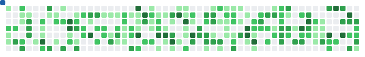

<!--
  Perfil: github.com/NasckDev
  Os SVGs em ./assets são animados (SMIL) e feitos à mão — sem serviço de terceiros.
  A snake do README (assets/snake-*.svg) é decorativa e não depende dos dados de contribuição.
  Os workflows em .github/workflows geram a snake real (branch output) e o card de métricas.
-->

  

 

  
  
  
  

 

  

 

Engenheiro front-end com **6 anos** construindo produtos digitais que precisam funcionar em escala. Especialista em **React e TypeScript**, com experiência real de produção em **Angular, Vue/Nuxt, Node.js e NestJS** — entrego o caminho inteiro: refinamento com Produto e Design, solução técnica, testes, rollout gradual com feature flags e acompanhamento de métricas depois do deploy.

Hoje na **MindMiners** (SaaS de inteligência de mercado). Antes, na **EY**, alocado no projeto da **Vivo (Telefônica)** — front-end e microsserviços para uma das maiores operações de telecom do Brasil.

 

  

<b>Ver detalhes de cada experiência</b>

 

**MindMiners** · Software Engineer Front-End · ago/2025 – atual · remoto
- Produto SaaS de pesquisa e inteligência de mercado em React + TypeScript
- Protótipos Figma → componentes reutilizáveis e acessíveis no Design System da empresa
- Fluxos complexos: filtros, formulários dinâmicos, modais, painéis redimensionáveis, tooltips e validações
- Integrações REST e serviços de IA com backends em C# e Python, tratando jornadas assíncronas, erros e regras de negócio
- Feature flags por plano, rollout gradual, rastreamento de eventos e métricas de adoção
- Acessibilidade: navegação por teclado, gerenciamento de foco, mensagens de feedback
- Solução de comunicação entre iframes e modais picture-in-picture

**EY → projeto Vivo (Telefônica)** · Software Engineer Front-End & Microsserviços · jul/2023 – ago/2025 · híbrido
- Aplicações corporativas de alto tráfego com **React, Angular/AngularJS, Vue.js, Nuxt.js e TypeScript**
- Microsserviços em **Node.js/NestJS** e contratos de integração REST entre front e back
- Testes unitários com Jest, code review, investigação e resolução de incidentes em produção
- CI/CD com Jenkins e ArgoCD; GitHub, GitLab e Azure DevOps

**EY** · Analista e Desenvolvedor Front-End e SAP Commerce · ago/2022 – ago/2023
- E-commerce SAP Commerce com internacionalização, integrações via API, feature flags e deploys em produção

**EY** · Trainee SAP Sales e SAP Commerce · fev/2021 – ago/2022
- Customização de objetos, telas e fluxos com C# e ABSL no SAP Application Studio

**Partners Digital** · Estagiário em Desenvolvimento SAP · ago/2020 – fev/2021
- Objetos no SAP Sales C4C, front-end, testes e melhorias de usabilidade

 

  

   
  

 

## Projeto em destaque

<table>
  <tr>
    <td width="45%">
      
    </td>
    <td>
      <b>Myportfolio</b> — React, TypeScript, Vite, Tailwind, Motion/GSAP  
      
      • Componentes acessíveis e animações com Motion/GSAP 
      • Função serverless com validação de respostas, credenciais restritas ao servidor e fallback para falhas 
      • Testes automatizados da API: sucesso, config ausente, payload inválido e falha de serviço 
      • Validação antes do build; deploy com Vercel + GitHub Actions
        
      <a href="https://nasck-myportifolio.vercel.app">Ver no ar</a> · <a href="https://github.com/NasckDev/Myportfolio">Código-fonte</a>
    </td>
  </tr>
</table>

<!-- Novos projetos: duplique o bloco acima trocando repo=NOME-DO-REPO -->

 

## Atividade

  <picture>
    <source media="(prefers-color-scheme: dark)" srcset="./assets/snake-dark.svg"/>
    
  </picture>

  

 

## Formação & Certificações

| | |
|:--|:--|
| **São Paulo Tech School (SPTech)** | Análise e Desenvolvimento de Sistemas · 2020 – 2022 |
| **Etec Jaraguá** | Técnico em Informática · 2018 – 2019 |
| **EY** | Artificial Intelligence – AI Engineering (Bronze) · 2025 |
| **Lund University** | IA, negócios e o futuro do trabalho · 2025 |
| **EY** | SAP Foundation · 2021 |
| **Idiomas** | Português nativo · Inglês intermediário · Espanhol intermediário |

 

  <b>Aberto a oportunidades como Senior Front-End Engineer</b> — remoto ou híbrido em São Paulo  
  
  
  
    
  São Paulo, SP · Brasil

